<!-- Matrix Header Banner -->
<p align="center">
  
</p>

<!-- Social Links & Status Badges -->
<p align="center">
  <a href="https://www.linkedin.com/in/marco-andr%C3%A9-garc%C3%ADa-cervantes-157418333/">
    
  </a>
  <a href="mailto:andre.garcia8219@gmail.com">
    
  </a>
  
</p>

<br/>

<table align="center" width="100%">
  <tr>
    <td>
      <h2 align="center">🟢 [ SYSTEM OPERATIONAL ] // ABOUT ME</h2>
      <p>
        Informatics Engineer and <b>Backend & DevOps Specialist</b> with <b>5 years of experience</b> building scalable software architectures, distributed data pipelines, and high-concurrency microservices.
      </p>
      <ul>
        <li>🔭 <b>Current Mission:</b> Asynchronous ETL data pipelines &amp; system synchronization (SITZ / PYL) at CISZ Zapopan.</li>
        <li>⚡ <b>Core Architecture:</b> Event-Driven Architectures, Asynchronous Messaging, Microservices &amp; Containerization.</li>
        <li>🎯 <b>Engineering Focus:</b> System Architecture, DevOps (CI/CD, Infrastructure as Code), Cloud &amp; AI-assisted engineering.</li>
        <li>🌍 <b>Mobility:</b> Open to global remote opportunities &amp; international mobility projects.</li>
      </ul>
    </td>
  </tr>
</table>

<br/>

---

## 🛠️ Matrix Tech Stack & Ecosystem

<table align="center" width="100%">
  <tr>
    <td width="50%" valign="top">
      <h3 align="center">⚡ Languages & Frameworks</h3>
      <p align="center">
        
        
        
        
        
        
      </p>
    </td>
    <td width="50%" valign="top">
      <h3 align="center">🐳 DevOps, Databases & Messaging</h3>
      <p align="center">
        
        
        
        
        
        
      </p>
    </td>
  </tr>
</table>

<br/>

---

## 📌 Featured Architectures & Projects

```gdb
[PROJECT 01] :: Spotify AI Playlist Organizer
├── Tech Stack : Python | Scikit-Learn | Spotipy API | OAuth 2.0
└── Summary    : Engineered a machine learning data pipeline that fetches high-dimensional audio features
                 via Spotify API and clusters tracks into dynamic mood-based playlists.

[PROJECT 02] :: LMS Isolated Code Runner
├── Tech Stack : PHP | Pyodide (WebAssembly) | Webhooks | Security Sandbox
└── Summary    : Integrated a WebAssembly-based Python engine into a web application to enable secure,
                 real-time client-side code execution for educational environments.
```

<br/>

---

<blockquote align="center">
  <b>"Simplicity is prerequisite for reliability."</b><br/>
  — <i>Edsger W. Dijkstra</i>
</blockquote>

